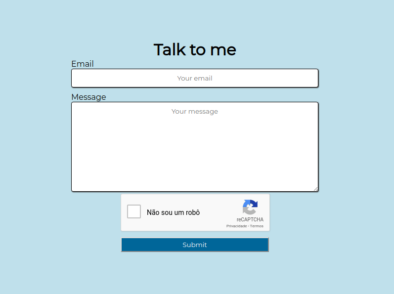
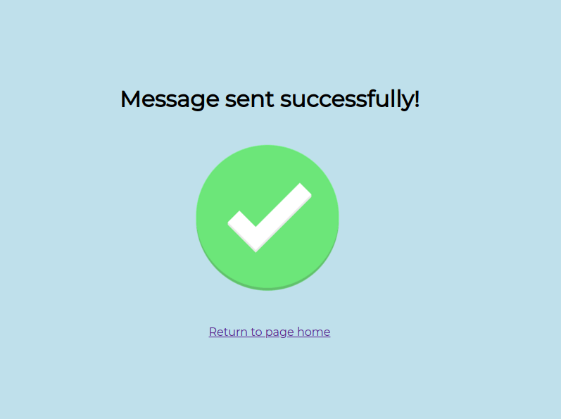
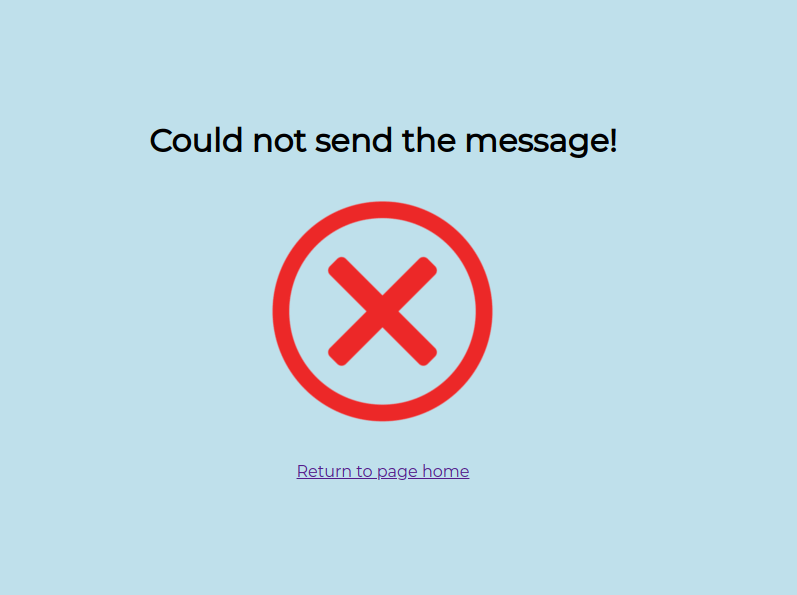

# :tada: send-email :tada:

Send email with nodejs technology

## Screenshots

### Home page :house:

 

### Sucess Page :heavy_check_mark:



### Error Page :x:

  

## Prerequisites :computer:

[nodejs](https://nodejs.org/en/)

## Installing :wrench:

Clone the project:
```bash
git clone https://github.com/franciscojsc/send-email.git
```

Enter the folder:
```bash
cd send-email
```

Create a `.env` file and add the following environment variables, replacing the corresponding values:
```
USER_EMAIL=your-email
PASS_EMAIL=your-password
HOST_EMAIL=your-host-email
PORT_EMAIL=your-host-port
CAPTCHA_CLIENT=your-key-recaptcha-client
CAPTCHA_SERVER=your-key-recaptcha-server
```

## Deployment :rocket:

Install the dependencies:
```bash
npm install
```

Launch the application:
```bash
npm start
```

Access the application at `http://localhost:3000`.

## License :memo:

This project is licensed under the MIT License - see the [LICENSE](LICENSE) file for details.
